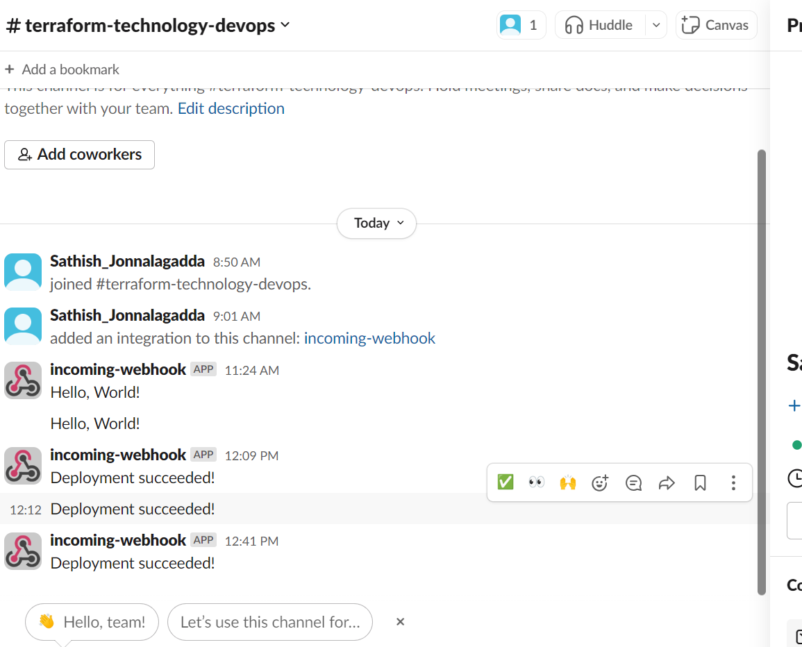

Author : Sathish Jonnalagadda
Created Date : 17-02-2024

# Terraform AWS Infrastructure Setup


## File Structure
```
Terraform-Assignment/
├── .github/
│   └── workflows/
│       └── deploy.yml          # GitHub Actions workflow for CI/CD
├── Terraform-Assignment/
│   ├── .gitignore              # Specifies intentionally untracked files to ignore
│   ├── main.tf                 # Main Terraform configuration file
│   ├── provider.tf             # Terraform provider configuration
│   ├── terraform.tfvars        # Variables values for the Terraform configuration
│   ├── variables.tf            # Declaration of variables used in the configuration
│   ├── modules/                # Modular configurations for specific AWS resources
│   │   ├── ec2/                # EC2 module with configurations for instances
│   │   │   ├── data.tf         # Data sources for the EC2 module
│   │   │   ├── main.tf         # Main configuration file for EC2 instances
│   │   │   ├── outputs.tf      # Outputs from the EC2 module
│   │   │   └── variables.tf    # Variables specific to the EC2 module
│   │   ├── vpc/                # VPC module with configurations for networking
│   │   │   ├── data.tf         # Data sources for the VPC module
│   │   │   ├── main.tf         # Main configuration file for the VPC
│   │   │   ├── outputs.tf      # Outputs from the VPC module
│   │   │   └── variables.tf    # Variables specific to the VPC module
│   │   └── Web_SecurityGroup/  # Module for web security group configurations
│   │       ├── main.tf         # Security group configurations
│   │       ├── outputs.tf      # Outputs from the security group module
│   │       └── variables.tf    # Variables specific to the security group module
│   └── user_data/              # Scripts for EC2 instance initialization
│       └── nginx_userdata.sh   # Script to install and configure Nginx on EC2 instances
└── README.md                   # This file

```
The file Structure follows the modular and resuable and standard  format for further usablity.


Note the Subnets, IGW and NAT is not declared as separate module, can be declared separately as other modules like ec2, vpc, and web_securityGroup for further resubality and quality


This Terraform configuration sets up a basic AWS infrastructure, including a Virtual Private Cloud (VPC), public and private subnets, and EC2 instances within the AWS Cloud. This setup is designed for educational or development purposes and should be customized for production environments.

## Overview

The configuration provisions the following resources:
- A VPC with a CIDR block of `10.0.0.0/16`.
- Two public subnets with CIDR blocks of `10.0.1.0/24` and `10.0.2.0/24`.
- Two private subnets with CIDR blocks of `10.0.3.0/24` and `10.0.4.0/24`.
- EC2 instances for running an Nginx server, using a pre-existing key pair for SSH access.

## Prerequisites

- AWS Account: You need an active AWS account.
- AWS CLI: Configured with access key, secret key, and default region.
- Terraform: Version 1.0.0 or later installed on your machine.
- SSH Key Pair: A key pair named `name` created in the AWS EC2 console or through the AWS CLI.

## Variables

The configuration uses the following variables:

- `vpc_cidr`: The CIDR block for the VPC.
- `public_subnet_cidr`: CIDR blocks for the public subnets.
- `private_subnet_cidr`: CIDR blocks for the private subnets.
- `key_name`: The name of the SSH key pair for EC2 instances.
- `ec2_names`: Names of the EC2 instances to be created.
- `public_subnets`: Names of the public subnets for identification.
- `private_subnets`: Names of the private subnets for identification.
- `env_prefix`: A prefix used for naming resources, indicating the environment.
- `instance_type`: The instance type for the EC2 instances.

## Usage Locally.

1. **Clone the Repository**: Begin by cloning this repository to your local machine or download the Terraform configuration files.

   ```
   git clone <repository-url>
   ```

2. **Initialize Terraform**: Navigate to the directory containing the Terraform configuration files and run:

   ```
   terraform init
   ```

3. **Review the Terraform Plan**: Generate and review the execution plan to see the actions Terraform will perform.

   ```
   terraform plan
   ```

4. **Apply the Configuration**: Apply the Terraform configuration to provision the AWS resources.

   ```
   terraform apply
   ```

   Confirm the action by typing `yes` when prompted.

## Customization

You can customize the configuration by modifying the variable values in `terraform.tfvars` or passing them through the command line.

## Cleanup

To destroy the resources created by this Terraform configuration, run:

```
terraform destroy
```

Confirm the action by typing `yes` when prompted.

---

This template provides a basic structure. Feel free to expand it with more details specific to your project, such as descriptions of output values, detailed setup instructions for prerequisites, or additional customization options.


## Github Action Setup


Once the build  and deploy is completed user gets the below message




